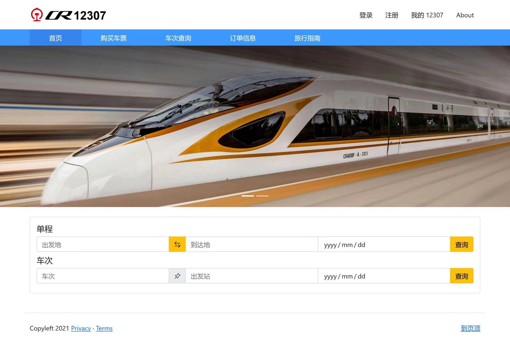

# 铁路订票系统 12307
> 中国科学院大学 数据库系统（2021春季学期）

## Overview
一个简单的铁路订票系统，提供单程查询、往返查询、车次查询、订单管理等功能，界面美观大方。

## Developer
* [cebarobot](https://github.com/cebarobot)
* [horrorChen](https://github.com/horrorChen)

## Dependence
We use Docker image [77qiqi/ucas-dbms-hw-2020:18.04](https://hub.docker.com/r/77qiqi/ucas-dbms-hw-2020) as our development environment.

* php-7
* PostgreSQL
